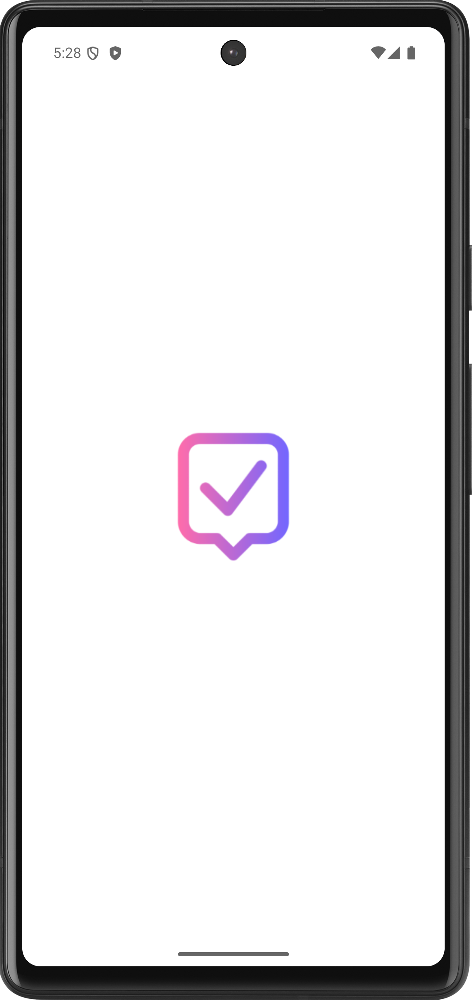
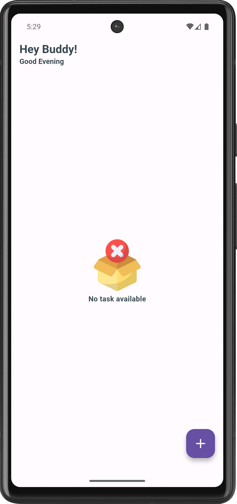
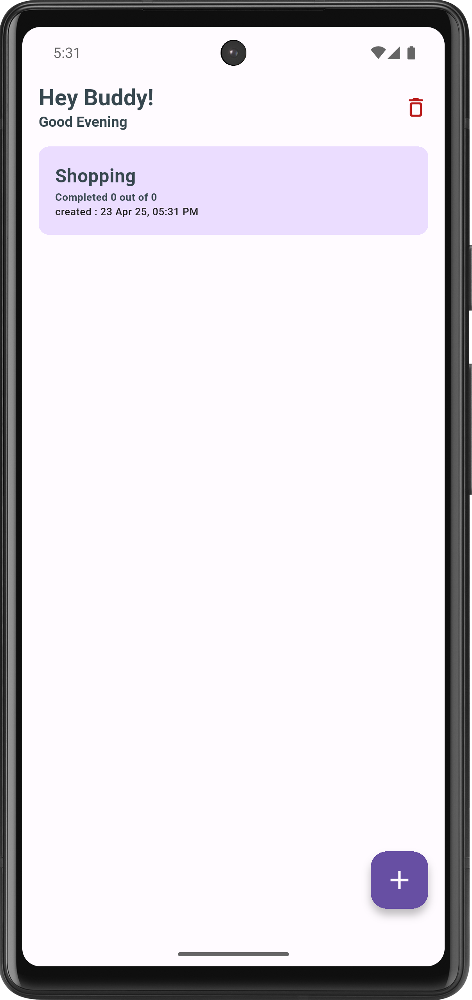
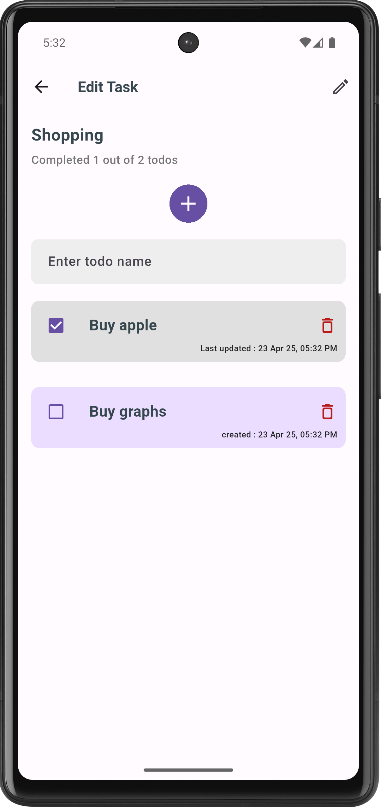

# ✅ DoneIt - Task & To-Do Management App

**DoneIt** is a clean, simple, and efficient task management app built using **Flutter**. It helps
you organize tasks, each with its own list of to-dos, to improve productivity and keep you focused.

---

## 🚀 Features

- 📋 Create and manage tasks
- ✅ Add multiple to-dos under each task
- 🧼 Simple and minimalistic UI
- 🧠 Built with clean architecture and Flutter best practices

---

## 📱 Screenshots

---

## 🛠️ Tech Stack

- **Framework**: [Flutter](https://flutter.dev/)
- **Language**: Dart
- **State Management**: Riverpod
- **Navigation**: Flutter Navigator
- **Local Storage**: SQLite

---

## 📜 Changelog

### [1.0.0+1] - 2025-04-24
- **New Features:**
  - Users can now **add** multiple to-dos under each task.
  - Users can now **delete** both tasks and individual to-dos.
